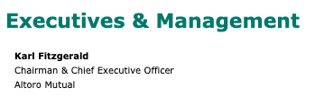
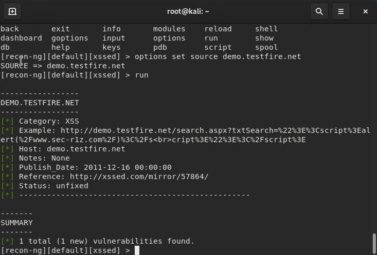
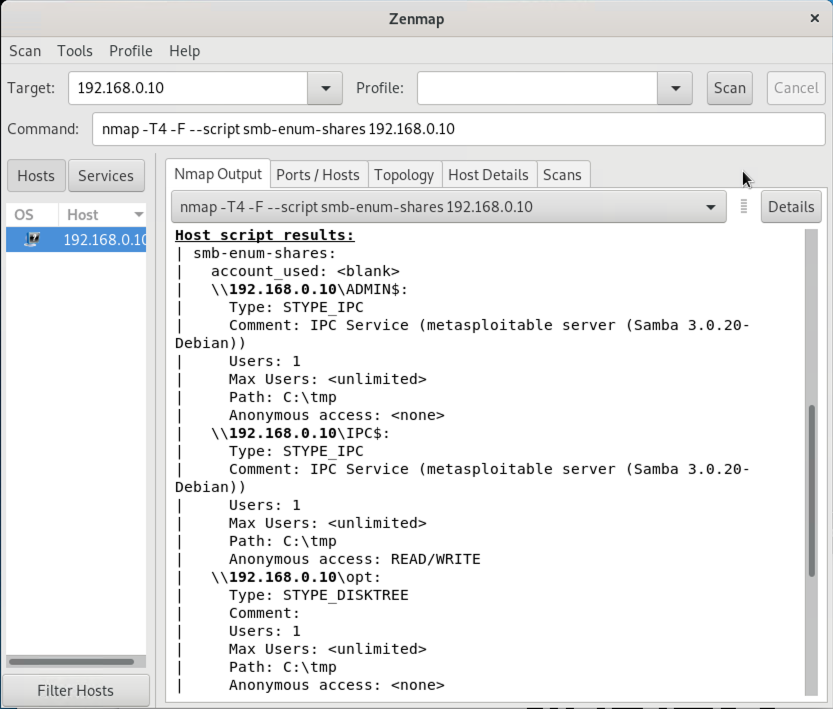
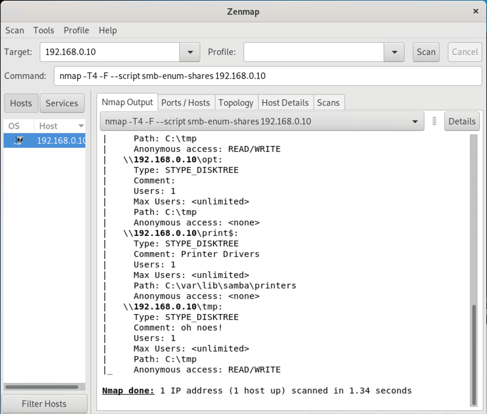

## Week 16 Submission File: Penetration Testing 1

### **Step 1: Google Dorking**

1. Using Google, can you identify who the Chief Executive Officer of Altoro Mutual is:

    Karl Fitzgerald

    

2. How can this information be helpful to an attacker:

     Karl Fitzgerald's name can be used for CEO Fraud, which is a type of spear phishing attack. 
     
     Cybercriminals will spoof email addresses in attempt to persuade the victim to perform a transaction. This can range from gift card scams to wire fraud, with millions of dollars being routed to the hacker's bank account.
     

### **Step 2: DNS and Domain Discovery**

Enter the IP address for `demo.testfire.net` into Domain Dossier and answer the following questions based on the results:

  1. Where is the company located: 

      Sunnyvale, CA

  2. What is the NetRange IP address:

      65.61.137.64 - 65.61.137.127

  3. What is the company they use to store their infrastructure:

      Rackspace Backbone Engineering

  4. What is the IP address of the DNS server:

      65.61.137.117

### **Step 3: Shodan**

What open ports and running services did Shodan find:

- Ports 80, 443, and 8080 are open.
- Services: Apache Tomcat/Coyote JSP engine | Apache-Coyote Vers. 1.1

### **Step 4: Recon-ng**

- Install the Recon module `xssed`. 
- Set the source to `demo.testfire.net`. 
- Run the module. 

Is Altoro Mutual vulnerable to XSS: **Yes**

### Step 5: Zenmap

Your client has asked that you help identify any vulnerabilities with their file-sharing server. Using the Metasploitable machine to act as your client's server, complete the following:

1. Command for Zenmap to run a service scan against the Metasploitable machine: 

    nmap 192.168.0.10
 
2. Bonus command to output results into a new text file named `zenmapscan.txt`:

    nmap -sS -sV -oN zenmapscan.txt 192.168.0.10

3. Zenmap vulnerability script command: 

    nmap --script smb-enum-shares 192.168.0.10

- Once you have identified this vulnerability, answer the following questions for your client:
1. What is the vulnerability:

   The script `nmap --script smb-enum-shares` allows us to enumerate shared folders using SMB (Server Message Block) protocol.
    
2. Why is it dangerous:

     It is dangerous because hackers can: 
    - determine the file system path and permissions
    - access private files that are being shared
    - place a Trojan in that shared directory or infect files

3. What mitigation strategies can you recommendations for the client to protect their server:

    User Access Management Policy
    
    - Setting policies allow only legitimate SMB traffic, while blocking the rest of the lateral movement between hosts.
    - Restricting access to only trusted IP ranges and devices will reduce the hacker's attack surface.
    

---
© 2020 Trilogy Education Services, a 2U, Inc. brand. All Rights Reserved.  

